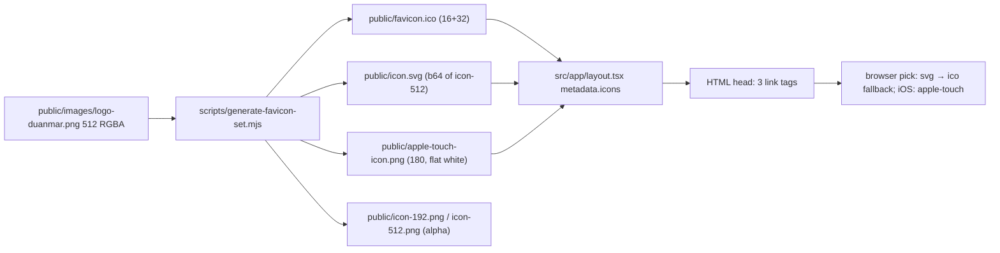

# Modern High-DPI Favicon & Web App Icon Metadata Set

**Date**: 2026-09-30 · **Type**: Feature (Assets/Metadata) · **Plan ID**: 260930-1402

## Executive Summary
Repo has zero favicon files (glob `**/favicon*` = none) and no `icons` field in root metadata (`src/app/layout.tsx:16-19`). Generate the full icon set from the real brand logo with a committed, re-runnable script, then expose the exact requested `<link>` tags from root metadata. Verification = byte-level unit tests + Chromium HTML/screenshot checks (Chromium is the only available browser).

## Context Links
- **Source asset**: `public/images/logo-duanmar.png` — 512×512 8-bit RGBA, transparent, 174952 B (verified via sharp); rendered circular at `src/components/layout/brand-logo.tsx:16`
- **Injection point**: `src/app/layout.tsx:16-19` (`metadata`); grep `icons:`/`manifest:` in `src/` = 0 hits → no page can override; `src/app/[locale]/layout.tsx` exports no metadata (only sanity popup dims at :28-29)
- **Next 16.3.6 renderer**: `node_modules/next/dist/lib/metadata/metadata.js:1621-1641` spreads icon props → `sizes`/`type` pass through, `rel` defaults `icon`/`apple-touch-icon`; `resolve-icons.js` accepts `{icon:[…], apple:[…]}`
- **Conventions**: `scripts/*.mjs` + npm scripts (`package.json:12-16`); `tests/run-unit.mjs` (tsx, `tests/unit/*.test.mts`), `tests/run-browser.mjs` (needs :3000, pattern `tests/browser/a-ux-microinteractions.mjs:10-27`)
- **Tooling**: ImageMagick absent; `sharp@0.35.4` only transitive via `next` (`npm ls sharp`); no `to-ico`/`favicons`/potrace, no SVG source in repo

## Requirements
### Functional
- [ ] `public/favicon.ico` (16+32), `public/icon.svg` (high-DPI, dark-tab), `public/apple-touch-icon.png` (180), `public/icon-192.png`, `public/icon-512.png` — all generated from the real logo, no fabricated art
- [ ] Root head renders exactly: `<link rel="icon" href="/favicon.ico" sizes="any">`, `<link rel="icon" href="/icon.svg" type="image/svg+xml">`, `<link rel="apple-touch-icon" href="/apple-touch-icon.png">` — on every route incl. `/en`, `/vi`
- [ ] Legacy `/favicon.ico` request answers 200 without HTML
- [ ] Visual: logo crisp, centered, 1:1 un-distorted at tab sizes (Chromium-verified)
### Non-Functional
- [ ] Deterministic re-run (committed outputs, no build-time generation); files <200 lines, kebab-case; no new runtime deps; gates lint/unit/browser/build green

## Key Decisions (locked, KISS/YAGNI/DRY)
1. **`public/` files + `metadata.icons`** (not `src/app/icon.*` conventions): guarantees legacy `/favicon.ico`, byte-exact control of required tags, single injection mechanism (conventions would double-inject if combined with metadata).
2. **`icon.svg` is canonical** — required tag href is `/icon.svg`; no `favicon.svg` duplicate despite asset-list wording.
3. **SVG = embedded raster**: `<svg viewBox="0 0 512 512"><image href="data:image/png;base64,…">` wrapping exact `icon-512.png` bytes. No vector source exists; manual tracing risks brand distortion ("no fabricated assets"). Transparent → dark-mode; square source → centered/undistorted.
4. **Hand-rolled PNG-in-ICO writer** (~50 lines: ICONDIR + 2 ICONDIRENTRY + PNG payloads, widths parsed from IHDR) — no ImageMagick, no new dep; 16/32 PNG-in-ICO supported by Chrome/Firefox/Edge/Safari.
5. **Promote `sharp` to explicit devDependency** (`^0.35.4`, already installed → dedupe with `next`); unit tests avoid sharp entirely by parsing PNG/ICO headers from raw buffers.
6. **apple-touch-icon flattened onto white** (iOS discards alpha → black bg otherwise); 16/32/192/512 keep alpha for tab/PWA flexibility.
7. **`site.webmanifest` deferred** (YAGNI — icons generated but not manifest-linked; see unresolved Q2).

## Architecture Overview

## Implementation Phases
| # | Phase | Create / Modify | Est |
|---|-------|-----------------|-----|
| 1 | [Icon generation pipeline](./phase-01-icon-generation-pipeline.md) | create `scripts/generate-favicon-set.mjs`, `scripts/lib/png-in-ico-writer.mjs`; edit `package.json` (script + sharp devDep) → outputs 5 files in `public/` | 1.5h |
| 2 | [Head metadata integration](./phase-02-head-metadata-integration.md) | edit `src/app/layout.tsx` (add `icons` to `metadata`) | 0.5h |
| 3 | [Verification tests + docs](./phase-03-verification-tests-docs.md) | create `tests/unit/favicon-assets.test.mts`, `tests/browser/z-favicon-head.mjs`; edit `docs/project-changelog.md` | 1h |

Dependency: P1 → P2 → P3 (assets must exist before head refs; head refs before HTML assertions).

## Testing Strategy
- **Unit** (`npm test`): existence + PNG IHDR dims (16/32/180/192/512) + colorType (alpha=6 kept; apple-touch flattened=2) + ICO header/entries/offsets + `icon.svg` has `viewBox="0 0 512 512"`, embedded base64 SHA-256 == `icon-512.png` bytes, no `<script`, no remote asset hrefs.
- **Browser** (`npm run test:browser`): link-tag triples exact & single-occurrence on `/en` + `/vi`; HTTP 200 + magic bytes for all 5 files; render harness (16/32/180 beside "DuanMar" text) → naturalWidth expected, aspect 1:1, screenshot `tests/.output/z-favicon-*.png`.
- **Gates**: `npm run lint`, `npm test`, `npm run test:browser`, `npm run build` (not concurrent with dev — `docs/project-changelog.md` CSS-404 warning).

## Security Considerations
- [ ] Generated `icon.svg`: no `<script>`, only `data:` image hrefs (unit-asserted) — safe as `image/svg+xml`; script reads local files only, no network/secrets/user input

## Risk Assessment
| Risk | Impact | Mitigation |
|------|--------|------------|
| `sharp` churn as transitive `next` dep | Med | explicit devDep `sharp@^0.35.4` (installed already) |
| Old Safari/Edge ignore SVG favicon | Med | `/favicon.ico sizes="any"` first → universal fallback; iOS via apple-touch |
| PNG-in-ICO vs ancient BMP-only decoders | Low | evergreen browsers only; 16/32 PNG-in-ICO universally supported today |
| Chromium-only automation | Med | byte+HTTP assertions cover logic; Safari/Firefox visual = residual (unresolved Q3) |
| White apple-touch bg wrong brand-wise | Low | single constant in script; 180px screenshot review |
| ~230KB base64 in `icon.svg` | Low | one cached asset; later option: embed 256px |

**Rollback** (fully additive, no state): P1 `git rm` 5 assets + revert `package.json` hunk; P2 revert `layout.tsx` hunk; P3 `git rm` 2 test files.

## Next Steps (TODO)
- [x] P1: devDep + script + ico-writer → run → 5 assets committed
- [x] P2: `layout.tsx` icons field → verify 3 tags on `/`, `/en`, `/vi`, `/en/about`
- [x] P3: unit 11/11 + browser 32/32 green, changelog `## 2026-09-30` Added entry (no roadmap file in `docs/`); code review applied (gitignore `.next-dev.log`, ICO ≤256 guard, bounds/SVG guards, harness natural-size asserts + finally-close) · docs impact: minor

**Unresolved questions**: (Q1) apple-touch bg — white vs brand color vs transparent(iOS-black)? (Q2) add minimal `site.webmanifest` linking 192/512 now or defer? (Q3) manual visual pass on Safari/Firefox needed (automation is Chromium-only)? (Q4) confirm `icon.svg` naming over `favicon.svg` alias?
