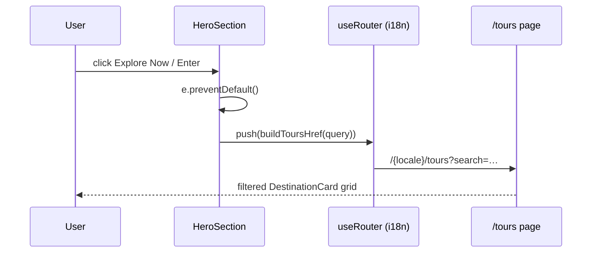

# Phase 2: Hero "Explore Now" Form Submit Refactor

**Priority**: P1 · **Status**: pending · **Est**: 1.5h · **Depends on**: Phase 1 (`buildToursHref`, `/tours` route) · **Owns**: `src/components/homepage/hero-section.tsx`, `docs/project-changelog.md`

## Context Links
- `src/components/homepage/hero-section.tsx` (73 lines, `"use client"` :1) — form :44-57 wraps ONLY input (`name="q"`, uncontrolled, :50-56, `action={\`/${locale}/search\`}` :45); Button OUTSIDE in sibling div :59-68 (`nativeButton={false}` + `render={<Link href="/explore" />}` :62-63); `useLocale` :19 used ONLY by form action :45; `useTranslations("home")` :18
- Router: `src/i18n/navigation.ts:4-5` `useRouter` from `createNavigation(routing)` — MUST use (locale prefix, `src/i18n/routing.ts:3-6` locales en/vi); `next/navigation` router would drop prefix
- Button: `src/components/ui/button.tsx:47-57` spreads `...props` onto Base UI primitive → `type` passes; in-session SSR probe confirmed `<Button type="submit">` renders `<button type="submit" …>` (Base UI internal default `@base-ui/react/.../useButton.js:184` does NOT win)
- `useRouter` probe: throws `invariant expected app router to be mounted` outside App Router → HeroSection cannot be unit-rendered; verification = manual checklist below

## Overview
Merge input+button into one `<form>` with controlled `useState` value; `onSubmit` → `preventDefault` → `router.push(buildToursHref(searchQuery))`. Pure behavior refactor — markup layout preserved exactly (see below). Enter key works natively via form submission.

## Key Insights
- **Layout preservation (critical)**: `Search` icon is `absolute left-3 top-1/2 -translate-y-1/2` (:49) — currently relative to the form (form height = input height). Once button moves inside form, MUST move `relative` to a wrapper div around icon+input, else icon centers over whole form (visual bug).
- **Gap rhythm**: old = outer `space-y-6` (`text-center space-y-6 max-w-3xl` :36) between form and button-div = 24px. New = form `space-y-6` between input-wrapper and button-div = same 24px token → identical vertical rhythm; h1↔p↔form gaps unchanged.
- **Horizontal**: `max-w-xl mx-auto` moves onto the form (was :47); button div centered inside 576px vs old 768px container — both center → button renders at identical x-position.
- Removing `action` drops no-JS GET fallback (old target `/search` was wrong destination anyway) — accepted degradation, documented.
- `useLocale` import + `locale` var become unused after removing `action` → must be removed (eslint no-unused-vars).

## Requirements
- Functional: controlled input; submit (click or Enter) → `preventDefault` → locale-prefixed `/tours?search=<encoded>`; empty/whitespace → `/tours`; label stays `home.exploreNow` (en :95 `Explore Now`, vi :95 `Khám phá ngay` — unchanged).
- Non-functional: zero visual change; file stays <200 lines; only hero-section.tsx changes (Phase 1 untouched files).

## Architecture
```
HeroSection (client)
  state: searchQuery (useState "")
  <form onSubmit={handleSubmit} className="max-w-xl mx-auto space-y-6">
    <div className="relative">          ← icon+input (relative moved here)
      <Search …/>  <input value={searchQuery} onChange={…} …/>
    </div>
    <div className="flex flex-wrap justify-center gap-4">   ← same classes as :59
      <Button type="submit" size="lg" className="px-8 py-4 text-lg">{t("exploreNow")}</Button>  ← drop nativeButton/render
    </div>
  </form>
```


## Related Code Files
**Modify (only)**: `src/components/homepage/hero-section.tsx`
- Imports: remove `useLocale` (:3, keep `useTranslations`), remove `Link` (:4), add `useRouter` from `@/i18n/navigation`, add `useState` from `react`, add `buildToursHref` from `@/lib/tour-search`
- Add `const [searchQuery, setSearchQuery] = useState("")`; `const router = useRouter()`
- Handler:
  ```ts
  const handleSubmit = (e: React.FormEvent<HTMLFormElement>) => {
    e.preventDefault();
    router.push(buildToursHref(searchQuery)); // trim+encode inside helper
  };
  ```
- Markup: replace :44-68 per Architecture block; keep input classes (:55), Search classes (:49), button size/className (:61, :64) verbatim; delete `action`/`method`/`name="q"`/`nativeButton`/`render={<Link href="/explore" />}`

**Modify**: `docs/project-changelog.md` — prepend `## 2026-09-30` entry, `- **[Feature] Hero search → /tours submit + /tours search page**` bullet listing hero form refactor, new `/tours?search=` consumer, extracted `search-normalize`, i18n keys; Verification line (gates + manual checklist).

**Create**: none. **Delete**: none.

## Implementation Steps
1. Edit imports + state + `handleSubmit` in `hero-section.tsx`.
2. Restructure markup :44-68 per Architecture block (form > relative-wrapper(input) > button-div).
3. Verify `Link`/`useLocale` no longer referenced; run `npx tsc --noEmit` + `npm run lint`.
4. `npm run dev` → execute Manual Checklist below.
5. Run all gates; update `docs/project-changelog.md`; commit-ready review.

## Todo List
- [ ] `hero-section.tsx`: imports/state/handler
- [ ] `hero-section.tsx`: form restructure (layout parity)
- [ ] Manual checklist (EN+VI)
- [ ] Gates: `npm run lint` · `npm test` · `npx tsc --noEmit` · `npm run build`
- [ ] `docs/project-changelog.md` entry

## Manual Verification Checklist (substitute for browser suite — puppeteer missing)
1. `/en`: type `ha long` → click **Explore Now** → URL `/en/tours?search=ha%20long`, h1 "Search Results", only matching cards.
2. Same input → press **Enter** → identical navigation (form-submit path, no `name` needed).
3. Clear input → submit → `/en/tours`, h1 "All Tours", all cards.
4. `/en/tours?search=zzzz` → "No tours match your search."
5. Accent-insensitive: query `da lat` matches `Đà Lạt`.
6. `/vi`: repeat 1 → `/vi/tours?search=…`, VI heading/labels (locale prefix present ✓).
7. Hero visual parity vs `git stash` baseline: icon vertically centered on input, 24px input↔button gap, button centered — screenshot or side-by-side.
8. Regression: `/en/search?q=…` still filters (normalize extraction).
9. `/vi/tours/domestic` + `/tours/international` still render (layout untouched); header/footer links (`src/components/layout/header.tsx:15-16`) unaffected.

## Success Criteria
- Observable: steps 1-9 pass; no `/explore` href remains in hero markup; `npm run build` outputs `/tours` route; all 4 gates green; changelog updated.

## Risk Assessment
| Risk | Likelihood×Impact | Mitigation |
|------|-------------------|------------|
| Base UI swallows `type="submit"` (useButton.js:184 default) | L×H | SSR probe shows user `type` wins ✓; manual step 1/2 confirms click+Enter actually submit |
| Wrong router → unprefixed URL (breaks i18n routing) | L×H | Import from `@/i18n/navigation` only; manual step 6 |
| Icon mis-centered after wrapper change | M×M | `relative` moves to input wrapper; manual step 7 visual check |
| Dead `/explore` index link (hero was sole `href="/explore"` user — grep src/ = hero-section.tsx:63 only) | L×L | Route `src/app/[locale]/explore` still redirects; other links target `/explore/destinations/*` — no 404 risk; leave route (YAGNI) |

## Security Considerations
- User input flows only through `encodeURIComponent` into a URL param; no HTML/JS interpolation; no secrets involved.

## Next Steps
- Code review (`code-reviewer`), changelog already handled. Unresolved questions → plan.md / final report.
