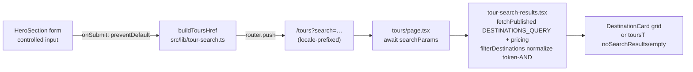

# Hero Search Submit + Tours Search Page

**Date**: 2026-09-30 · **Type**: Feature/Refactor · **Plan ID**: 260930-1420

## Executive Summary
Hero "Explore Now" button is a static `<Link href="/explore">` (`src/components/homepage/hero-section.tsx:59-68`) ignoring the adjacent search input. Convert input+button into one `<form>` with controlled state; `onSubmit` → `preventDefault()` → `router.push(buildToursHref(query))` via locale-aware router (`src/i18n/navigation.ts:4-5`). `/tours` currently 404s (`src/app/[locale]/[...rest]/page.tsx:12` — no `page.tsx` in `src/app/[locale]/tours/`), so Phase 1 creates it: server component reads `searchParams.search`, filters real Sanity `destination` docs (accent-insensitive, DRY-extracted `normalize`), renders `DestinationCard` grid.

## Context Links
- **Related Plans**: `plans/260930-1402-favicon-webapp-icon-set/` (unrelated); site-wide `/search` page (`src/app/[locale]/search/page.tsx`) = OUT OF SCOPE, untouched
- **Reference Docs**: `docs/project-changelog.md` (update at end); `docs/code-standards.md`
- **Key code (verified)**: hero `src/components/homepage/hero-section.tsx:44-68`; router `src/i18n/navigation.ts:4-5`; queries `src/sanity/queries/destinations.ts:4-19`, `src/sanity/queries/tour-pricing.ts:18`; grid pattern `src/components/tours/tour-category-section.tsx:23-58`; `Destination` type `src/components/explore/destination-card.tsx:12-23`; normalize precedent `src/components/search/search-client.tsx:30-35`

## Requirements
### Functional
- [ ] Single `<form>` wraps input + Explore Now; input controlled by `useState` (hero-section.tsx)
- [ ] Button = `<Button type="submit">` (Base UI passes `type` through — SSR-probed: renders `type="submit"`; internal default at `@base-ui/react/.../useButton.js:184` is overridden by user prop)
- [ ] `onSubmit`: `e.preventDefault()`; trimmed query → `router.push(\`/tours?search=${encodeURIComponent(q)}\`)`; empty/whitespace → `router.push("/tours")`; Enter key = same path
- [ ] New `src/app/[locale]/tours/page.tsx` consumes `search` (`Promise<{search?: string}>`, Next 16 pattern `src/app/[locale]/search/page.tsx:131-137`), filters + renders matched tours; no-match → `tours.noSearchResults`
- [ ] New i18n keys added to BOTH `src/messages/en.json:1076+` and `src/messages/vi.json:1076+` (`tours` ns) — enforced by `tests/unit/i18n-parity.test.ts:40-57`

### Non-Functional
- [ ] Visual layout byte-identical (icon/input/button classes + 24px `space-y-6` rhythm preserved — details in phase-01)
- [ ] Files <200 lines, kebab-case; real data only (no mocks); locale prefix preserved on push (next-intl `createNavigation`, routing `src/i18n/routing.ts:3-6`)
- [ ] Gates green: `npm run lint`, `npm test`, `npx tsc --noEmit`, `npm run build`

## Architecture Overview

**Data flow**: user text → `useState` → trim → `encodeURIComponent` → URL param → server `searchParams` → in-memory filter (NFD/đ/case-insensitive, token AND mirroring `search-client.tsx:49-55`) → grid/empty state. Filtering = **server-side** (KISS: page already async server pattern; Sanity fetch cached via `fetchPublished` (`src/sanity/lib/fetch-published.ts:30-46`, key = query+params so all searches share cache); no new client JS; fail-open `null` → `?? []` like `tour-category-section.tsx:36`).

## Implementation Phases
### Phase 1: Search foundation + /tours destination page (Est: 2.5h)
Detail: [`phase-01-search-foundation-tours-page.md`](phase-01-search-foundation-tours-page.md)
Creates: `src/lib/search-normalize.ts`, `src/lib/tour-search.ts`, `src/app/[locale]/tours/page.tsx`, `src/components/tours/tour-search-results.tsx`, `tests/unit/search-normalize.test.mts`, `tests/unit/tour-search.test.mts`. Modifies: `src/messages/en.json`, `src/messages/vi.json`, `src/components/search/search-client.tsx` (normalize extraction, DRY).

### Phase 2: Hero form submit refactor (Est: 1.5h)
Detail: [`phase-02-hero-search-submit.md`](phase-02-hero-search-submit.md)
Modifies: `src/components/homepage/hero-section.tsx` (only code file), `docs/project-changelog.md`. Depends on Phase 1 (route + `buildToursHref` must exist). No file overlap between phases.

## Testing Strategy
- **Unit** (`npm test` → `tests/run-unit.mjs`, node:test + tsx): `tests/unit/tour-search.test.mts` (buildToursHref: empty→`/tours`, trim, encoding; filterDestinations: accent/đ/case-insensitive name+country+description+region match, token AND, no-match→[], empty query→all), `tests/unit/search-normalize.test.mts` (NFD strip, đ→d, lowercase, idempotent). Existing `i18n-parity.test.ts` validates new keys.
- **NOT unit-testable**: HeroSection render — `useRouter` from `next/navigation` throws `invariant expected app router to be mounted` outside App Router (probed in-session). Verified manually instead (checklist in phase-02).
- **Manual/E2E**: `npm run dev` — button click + Enter + empty submit + `/vi` locale + unmatched query + site `/search` regression. `npm run test:browser` = **pre-existing gap**: `puppeteer` absent from root `node_modules` (`.claude/skills/chrome-devtools/scripts/lib/browser.js:5` imports it) → browser suite cannot run here; state, don't assume pass.
- **Gates**: `npm run lint` · `npm test` · `npx tsc --noEmit` · `npm run build`

## Security Considerations
- [ ] Query URI-encoded before push (prevents URL structure injection); rendered output React-escaped (no XSS via query)
- [ ] No new env/keys/secrets; Sanity reads use existing `fetchPublished` published-perspective only

## Risk Assessment
| Risk | Impact | Mitigation |
|------|--------|------------|
| Base UI Button drops `type="submit"` (internal default `useButton.js:184`) | High | Probed SSR: `type="submit"` renders ✓; manual click-check in phase-02 checklist |
| Locale prefix lost on push (used wrong router) | High | MUST import `useRouter` from `@/i18n/navigation` (`navigation.ts:4-5`), never `next/navigation`; manual `/vi` check |
| `normalize` extraction regresses site `/search` | Med | Identical logic move; manual `/search?q=` regression step |
| i18n keys added to one locale only | Med | Same-task edit both files; `npm test` parity check fails fast |
| `/tours` overlaps `/explore/destinations` listing | Low | Product overlap flagged as unresolved Q; both routes kept (YAGNI) |
| Browser tests unavailable (puppeteer missing) | Low | Pre-existing gap; manual checklist substitutes; documented unresolved |

## Quick Reference
```bash
npm run lint && npm test && npx tsc --noEmit && npm run build   # gates
node .claude/scripts/set-active-plan.cjs plans/260930-1420-hero-search-submit
```
Config: `tsconfig.json` (`strict`+`noEmit` @ :11-12, `@/*`→`src/*` @ :25-29) · `tests/run-unit.mjs` (auto-discovers `tests/unit/*.test.{ts,mts}`)

## TODO Checklist
- [x] P1: `search-normalize.ts` + `tour-search.ts` + search-client extraction
- [x] P1: `tours/page.tsx` + `tour-search-results.tsx` + i18n keys (en+vi)
- [x] P1: unit tests green (`npm test` 26/26)
- [x] P2: hero-section form refactor (controlled state, submit, router.push)
- [x] P2: browser checklist (ad-hoc `tests/.output/hero-search-check.mjs` 19/19 — EN/VI, Enter, empty, no-match, geometry parity, /search regression)
- [x] P2: gates (lint 0 / test 26/26 / tsc 0 / build 0 incl. `ƒ /[locale]/tours`) + `docs/project-changelog.md`
- [x] Code review passed · **review fixes applied**: `searchParams` array guard (`?search=a&search=b` TypeError), changelog evidence claims tightened (filtered-grid assertion now = 1/3 cards), ad-hoc script assertions de-tautologized
- Deferred (unresolved Qs): commit browser test for hero submit · nav link to `/tours` · `/explore/destinations` overlap
