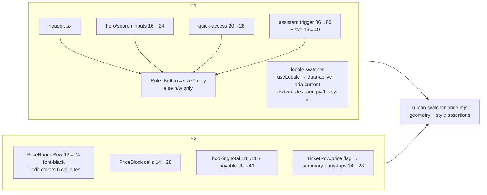

# Global Icon / Switcher / Price Prominence

**Date**: 2026-09-30 · **Type**: Feature (UI) · **Plan ID**: 260930-1544

## Executive Summary
Three presentational changes: (1) upscale primary header/nav/input icons ~150% and the chatbot trigger to 80px, (2) repair locale-switcher active state (styling exists but `data-active` is never set → both locales look identical) + enlarge for tap, (3) double every price figure to 200% + `font-black` so price dominates any tour container. No logic, i18n-key, data, or formatting (`src/lib/pricing.ts`) changes.

## Context Links
- **Related**: `plans/260930-1420-hero-search-submit/`, `plans/260930-1402-favicon-webapp-icon-set/` (both completed) · **Docs**: `docs/project-changelog.md` (append under `## 2026-09-30`); no `docs/code-standards.md` exists → docs impact = changelog only
- **CRITICAL verified constraint** (probed 2026-09-30 on running dev server): Button base class `src/components/ui/button.tsx:6` carries `[&_svg:not([class*='size-'])]:size-4` (higher specificity than `h-*`/`w-*`). Measured: `h-5 w-5` in Button → **16px**; `h-7 w-7` in Button → **16px** (still overridden); `size-7` alone → **28px** ✓; `size-7` + leftover `h-5 w-5` → **20px** (h/w wins cascade). **Rule: inside Button use `size-*` ONLY (strip h/w); outside Button use `h-* w-*` ONLY.** `cn` = twMerge drop-in (`node_modules/cn/package.json`) so `className="size-20"` overrides `size="icon"`'s `size-9`.

## Requirements
### Functional
- [ ] Primary icons → 28px (`size-7`/`h-7 w-7`), input adornment icons → 24px (`h-6 w-6`); chatbot trigger 36→80px (`size-20`) + inner icon 16→40px (`size-10`)
- [ ] Locale switcher: active locale unmistakable (extrabold + bg-muted + full opacity + `aria-current="true"`), inactive muted; control ~36px tall (was 26px)
- [ ] Every price figure exactly 200% + `font-black`; labels/prose sentences/table headers/disclaimers untouched
### Non-Functional
- [ ] Existing browser-test invariants stay green: `aria-pressed==0` outside reviews (`c-booking.mjs:111-114`, `s-tour-hero-carousel.mjs:190-193`), travel-date dd classes (`f-ui.mjs:153`), locale button `textContent==="en"|"vi"` (`r-entry-popup-cms.mjs:232-240`), assistant mobile no-overflow (`i-ai-assistant.mjs:252-268`), tooltip structure (`a-ux-microinteractions.mjs:45-87`)
- [ ] No horizontal overflow at 375px; files <200 lines; YAGNI/KISS/DRY (shared primitives edited once)
- [ ] Gates: `npm run lint` 0 · `npm test` 26/26 · `npx tsc --noEmit` 0 · `npm run build` 0 (dev stopped) · browser suite baseline **26/28** (pre-existing env failures: `b-booking-confirmation-email.mjs` `BOOKING_EMAIL_DELAY_MS`, `revalidate-webhook.mjs` missing `SANITY_REVALIDATE_SECRET` — re-verified FAIL) → target **27/29** with new test

## Architecture Overview


## Implementation Phases
### Phase 1: Global icons + locale switcher (Est: 1.5h)
Detail: [`phase-01-global-icons-and-locale-switcher.md`](phase-01-global-icons-and-locale-switcher.md) — Modify: `src/components/layout/header.tsx` (:74,:86,:97→`size-7`; :106,:113→`h-6 w-6`), `src/components/homepage/hero-section.tsx:55`, `src/components/search/search-client.tsx:65`, `src/components/homepage/quick-access-icons.tsx:24`, `src/components/assistant/assistant-widget.tsx` (:210 `size-20`, :213 `size-10`), `src/components/layout/locale-switcher.tsx`. No file overlap with Phase 2.
### Phase 2: Price prominence (Est: 1.5h)
Detail: [`phase-02-price-prominence.md`](phase-02-price-prominence.md) — Modify: `src/components/pricing/price-range.tsx`, `src/components/pricing/price-block.tsx` (:73,:76), `src/components/booking/booking-pricing-section.tsx:72`, `src/components/booking/booking-payment-section.tsx:169`, `src/components/booking/ticket-rows.ts` (+`price` flag), `src/components/booking/booking-summary.tsx:127-133`, `src/components/my-trips/my-trips-detail.tsx:98-104`. Independent of Phase 1.
### Phase 3: Browser test + gates + docs (Est: 1h)
Detail: [`phase-03-tests-gates-and-docs.md`](phase-03-tests-gates-and-docs.md) — Create `tests/browser/u-icon-switcher-price.mjs`; modify `docs/project-changelog.md`. Depends on Phase 1 + 2.

## Testing Strategy
- **New browser test** (dev server :3000): computed sizes via `getBoundingClientRect` (±1px): header/quick icons 28, input icons 24, trigger 80 + inner svg 40; switcher button h≥32 & fs≥14, active fw≥800/opacity 1/bg≠transparent/`aria-current="true"` vs inactive opacity≤0.65 & fw<active, click "en"→`/en` + active flips; prices: card value fs≥24 & ≥2× label fs & > card `h3` fs, PriceBlock td ≥28, checkout total ≥36, payable ≥40, summary total ≥28; 375px `scrollWidth<=innerWidth` on `/vi`, tour detail, checkout (after QR shown)
- **Regression re-run** (invariant owners): `i-ai-assistant`, `g-header`, `a-ux-microinteractions`, `f-ui`, `c-booking`, `c-payment`, `d8-a11y`, `r-entry-popup-cms`, `s-tour-hero-carousel`, `l-navbar`, `p-tours-category`, `m-footer-brand` → full suite 27/29 · **Unit**: none new (CSS not unit-assertable); `npm test` stays 26/26

## Security Considerations
- [ ] No new env/keys/inputs; text stays React-escaped; no data/CMS fetch changes

## Risk Assessment
| Risk | Impact | Mitigation |
|------|--------|------------|
| Button svg override silently keeps icons 16px if `h/w` used | High | Size rule + probe table in phase-01; test asserts 28px real geometry |
| `aria-pressed` on switcher breaks `c-booking` B6 + `s-tour-hero` S3 invariants | High | Use `aria-current="true"` instead (zero selector collisions) |
| 24-28px prices overflow card grid / price table at 375 | Med | `flex-wrap` in `PriceRangeRow`; PriceBlock keeps `overflow-x-auto`; overflow asserts at 375 |
| Switcher inactive `opacity-60` ≈2.6:1 contrast (AA fail for 14px) | Med | User-specified; flagged as unresolved Q — fallback: drop opacity, keep weight+bg delta |
| Pre-existing 2 browser failures read as regressions | Med | Baseline documented; success = 27/29 not 29/29 |

## Quick Reference
```bash
npm run dev                    # :3000, log .next-dev.log
npm run lint && npm test && npx tsc --noEmit
npm run build                  # ONLY with dev server stopped (CSS-404 note, docs/project-changelog.md)
npm run test:browser           # 29 files after P3; expect 27/29
node .claude/scripts/set-active-plan.cjs plans/260930-1544-icon-switcher-price-prominence
```

## TODO Checklist
- [ ] P1: header/input/quick-access/chatbot icons per size rule + locale switcher active state/sizing
- [ ] P2: 7 price files (exact 2× + font-black) + overflow check
- [ ] P3: `u-icon-switcher-price.mjs` green + regression set
- [ ] P3: gates (lint/test/tsc/build) + changelog entry
- [ ] Code review passed
