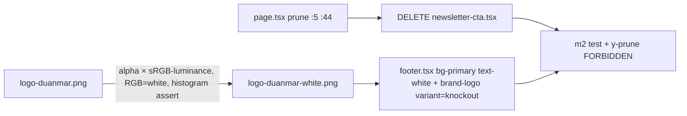

# Footer Red Theme + Newsletter Prune + Knockout Logo

**Date**: 2026-09-30 · **Type**: Feature (UI) · **Plan ID**: 260930-1610

## Executive Summary
Three coupled UI changes: (1) delete the homepage "Stay Updated" newsletter CTA (it is NOT inside the footer — rendered only from `src/app/[locale]/page.tsx:5,44`), (2) invert the global footer from `bg-muted/50` to brand-red `bg-primary` with all typography white, (3) swap the footer's solid logo for a generated knockout asset (transparent + white strokes, red shows through). No i18n-key, data, or routing changes.

## Context Links
- **Related**: `plans/260930-1544-icon-switcher-price-prominence/` (style) · **Docs**: `docs/project-changelog.md:509` append under `## 2026-09-30`; Docs impact: minor
- **Research corrections (re-verified)**: (a) `y-homepage-prune.mjs:93` Y3 asserts ONLY `storiesH2.includes(featuredDestinations)`; "Stay Updated" appears only in Y3 *detail* JSON (`:94`); `tests/` grep for `Stay Updated|Subscribe|newsletter` = **0 hits** → removal breaks NO test; change = ADD `"Stay Updated"` to `FORBIDDEN` (`:23-26`) = strengthening, requirement-driven. (b) Source logo = **black disc + WHITE pig + white lettering + red crosshair** (research said inverted). Research's `alpha×(1−lum)` validated → **filled white badge** (41.4% transp/46.1% white) = violates "no background fill". Correct: **`alpha_new = alpha_orig × luminance`** → **67.4% transp / 20.0% white / 12.6% semi**, render on `#9f0618` visually verified (white strokes/letters/pig, red through ring) ✓.
- **Measured contrast** (from `globals.css` tokens): `--primary oklch(0.444 0.177 25.331)` → **rgb(159,6,24) #9f0618**; white-on-red **8.36:1** · `text-white/80` hover **5.66:1** · `/70` 4.56 rejected · current `hover:text-foreground` rgb(9,9,11)-on-red **2.38:1** (must go) · Tailwind `red-700` ≈ rgb(193,0,7) ≠ brand → token wins.

## Locked Decisions
| # | Decision | Justification |
|---|----------|---------------|
| D1 | **Delete** `newsletter-cta.tsx` + import/usage; ADD `"Stay Updated"` to Y1 `FORBIDDEN` (both locales) | Only usage `page.tsx:5,44` (grep verified); zero tests assert it; FORBIDDEN = anti-regression guard (strengthening, not weakening) |
| D2 | Red = **`bg-primary`** token; root `bg-primary text-white`; strip all `text-muted-foreground`/`hover:text-foreground`; links → `hover:text-white/80`; root `border-t` dropped, bottom divider → `border-white/20` | DRY (single brand-red source; red-700 ≠ brand); 8.36:1 base / 5.66:1 hover; `text-white` on root covers wordmark `BrandWordmark` inheritance (footer.tsx:34 has no color class → would be 2.38:1 on red if missed) |
| D3 | `scripts/generate-knockout-logo.mjs` + npm `logo:knockout` → `public/images/logo-duanmar-white.png` (512 only); formula `alpha×lum`, RGB=white; in-script histogram assert (transp ≥40%, white ≥10%, else exit 1); `BrandLogo` gains `variant?: "default"\|"knockout"` | sharp ^0.35.5 precedent (`generate-favicon-set.mjs`); 88px display needs only 512 (1024 source doesn't exist → YAGNI); variant prop = footer-only swap, header untouched |
| D4 | **Untouched**: header logo (`header.tsx:40` size 36, variant default — only 2 BrandLogo call sites total), `BrandWordmark`, promo modal, footer grid geometry (`o-footer-refinement`/`q-footer-asym-layout` invariants), `messages/*.json`, `print:hidden` | KISS: structure/i18n/geometry untouched; only colors + img src change |
| D5 | Acceptance = computed-color + contrast + canvas-pixel assertions in NEW browser test + 88px screenshot | `d8-a11y.mjs` only covers checkout status text (`:76-115`) — no existing footer color coverage |

## Requirements
### Functional
- [ ] "Stay Updated" newsletter section gone from `/` (root), `/vi`, `/en`; component file deleted
- [ ] Footer container `bg-primary`; all typography (3 h3 headings, brand h3/wordmark, tagline, 10 nav/contact links, copyright, 4 legal links) computed `rgb(255,255,255)`
- [ ] Footer img = `/images/logo-duanmar-white.png` (knockout: ≥40% transparent, white strokes); header logo unchanged
### Non-Functional
- [ ] Contrast ≥4.5:1 for normal text (expected 8.36 base / 5.66 hover); grid geometry & link labels byte-identical (F1-F11, O1-O2b, Q1-Q5 stay green)
- [ ] Files <200 lines; YAGNI/KISS/DRY; gates: `lint` 0 · `npm test` 26/26 · `tsc` 0 · `build` 0 (dev stopped) · browser **28/30** (today 27/29; same 2 env failures: `b-booking-confirmation-email.mjs` `BOOKING_EMAIL_DELAY_MS`, `revalidate-webhook.mjs` missing `SANITY_REVALIDATE_SECRET`)

## Architecture


## Implementation Phases
1. **Phase 1 — Newsletter prune (0.75h)**: [`phase-01-newsletter-prune.md`](phase-01-newsletter-prune.md) — Modify `src/app/[locale]/page.tsx` (:5,:44) · **Delete** `src/components/homepage/newsletter-cta.tsx`. Independent of P2/P3.
2. **Phase 2 — Knockout asset pipeline (1h)**: [`phase-02-knockout-logo-pipeline.md`](phase-02-knockout-logo-pipeline.md) — Create `scripts/generate-knockout-logo.mjs` · Modify `package.json` (`logo:knockout`) · Generate `public/images/logo-duanmar-white.png`. **Blocks Phase 3** (asset must exist before swap).
3. **Phase 3 — Footer red theme + logo swap (1.25h)**: [`phase-03-footer-red-theme.md`](phase-03-footer-red-theme.md) — Modify `src/components/layout/footer.tsx` (root :28, links :46/:69/:86, tagline :36, bottom :96, legal :101/:108/:114/:120, logo :32), `src/components/layout/brand-logo.tsx`. Depends on P2.
4. **Phase 4 — Tests + gates + docs (1h)**: [`phase-04-tests-gates-and-docs.md`](phase-04-tests-gates-and-docs.md) — Create `tests/browser/m2-footer-red-knockout.mjs` · Modify `tests/browser/y-homepage-prune.mjs` (FORBIDDEN), `docs/project-changelog.md`. Depends on P1-P3.

## Testing Strategy
- **New** `m2-footer-red-knockout.mjs`: footer bg == `var(--primary)` ref-div color (rgb(159,6,24)); `footer`, `footer h3/a/p` all `rgb(255,255,255)`; contrast(white,bg) ≥4.5 (canvas helpers, `d8-a11y.mjs:20-26` pattern); footer img src contains `logo-duanmar-white` + raw `/images/logo-duanmar-white.png` drawn to canvas: corner α=0, transparent ≥40%, opaque-white ≥10%; "Stay Updated"/"Subscribe" absent in body text on `/vi`+`/en`; bottom `border-top-color` = white w/ alpha≈0.2; zero pageerrors; footer screenshot @88px
- **Regression**: `m-footer-brand` (F8 substring `logo-duanmar` ⊂ `logo-duanmar-white.png` ✓), `o-footer-refinement`, `q-footer-asym-layout`, `y-homepage-prune` (Y3 detail JSON shrinks — assertion unchanged), `g-header` (header logo ≤40px H2/H5), `d8-a11y` → suite **28/30** · **Unit**: none (no unit refs to newsletter/footer/logo except unrelated email-signature check)

## Security Considerations
- [ ] No new env/inputs/URLs; static local PNG only; text stays React-escaped; no CMS/query changes

## Risk Assessment
| Risk | Impact | Mitigation |
|------|--------|------------|
| Wrong knockout formula (research's 1−lum) → white-filled badge | High | Corrected to `lum` formula; validated render + histogram in P2; in-script assert blocks bad output |
| Leftover `text-muted-foreground`/`hover:text-foreground` → 2.38:1 fail | High | P3 class map strips every instance; m2 asserts ALL footer text white |
| Footer swapped before asset generated → next/image 404 | Med | P2 strictly before P3 (dependency listed); m2 fails fast on src/alpha |
| Dark mode later activated: `dark --primary` #da534f + white = 3.94:1 AA fail | Med | Dark unreachable today (no toggle, no `.dark` ever set — `layout.tsx:34`, grep=0); documented as unresolved |
| Pre-existing 2 env browser failures read as regressions | Med | Baseline pinned: success = 28/30, same 2 names |
| `npm run build` CSS-404/MIME with dev running | Low | Build ONLY with dev stopped (documented incident, changelog) |

## Quick Reference
```bash
npm run logo:knockout           # regenerate knockout (deterministic, assert-guarded)
npm run dev > .next-dev.log 2>&1 &   # :3000
npm run lint && npm test && npx tsc --noEmit
npm run build                   # ONLY dev stopped; then restart dev
npm run test:browser            # expect 28/30 after P4
node .claude/scripts/set-active-plan.cjs plans/260930-1610-footer-red-knockout  # controller runs after approval
```

## TODO Checklist
- [ ] P1: page.tsx prune + delete component
- [ ] P2: knockout script + asset + histogram assert
- [ ] P3: footer class map + BrandLogo variant
- [ ] P4: m2 test green + y-prune FORBIDDEN + gates (28/30) + changelog
- [ ] Code review passed
